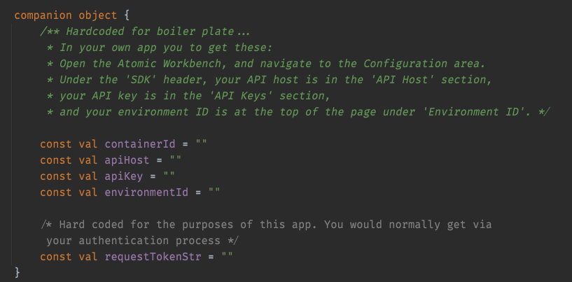

# Android Boilerplate App

This is a boiler-plate app to get you started with the Atomic SDK for Android. The App implements a Login, Logout, Card Count, Stream Container. Flow as shown below.

The code is based around the [documentation] (https://documentation.atomic.io/sdks/android) and
designed to get you up and running as quickly as possible, not necessarily as best practice.

The app won't run out of the box, you will need to add your own values to `BoilerPlateViewModel`
in the companion object. 

Instructions are as follows

    - Open the [Atomic Workbench] (https://workbench.atomic.io/), and navigate to the Configuration area.
    - Under the 'SDK' header, your API host is in the 'API Host' section, your API key is in the 'API Keys' section
    - your environment ID is at the top of the page under 'Environment ID'.

## Runtime Variables

For an example of how to set runtime variables in your code, see `MainActivity` and the code starting
at `applyHandlers`

## Notifications

An example of how to receive and create in app notifications can be found in `BolierplateFirebaseMessaging`
You will have to supply your own google-services.json file from your own app on the Firebase console.
Information for the whole process can be found [here](https://documentation.atomic.io/sdks/android#notifications)
including the Firebase setup documentation.
